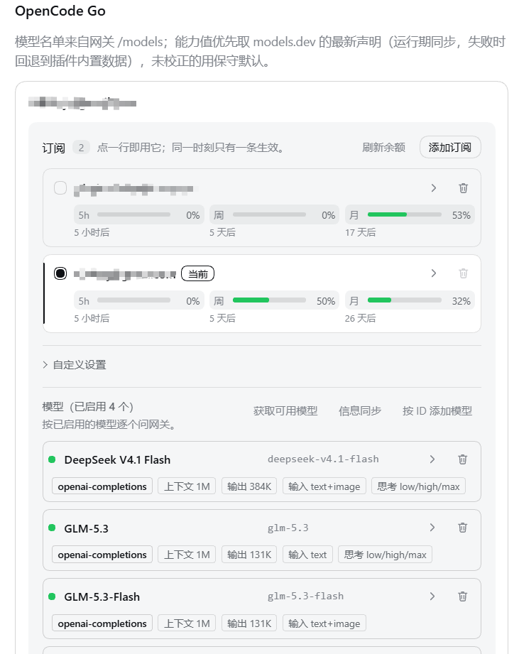

# dsh-opencodego

给 [DeepSeek Harness](https://github.com/deepseek-ai/deepseek-harness) 用的 **OpenCode Go** 提供方插件。

它把 OpenCode Go(以及任何 OpenCode 风格的 OpenAI 兼容网关)接进 DSH,并且**按每个模型实际支持的协议**发请求
(`openai-completions` / `openai-responses` / `anthropic-messages`),不用你手配。

模型能力**不靠猜**:插件会真的去问网关,把"这个模型还能不能用、走哪个协议、思考档位到底哪些管用"测出来。

---



## 安装

```bash
dsh plugin --profile web add github:whoiszzj/dsh-opencodego
```

装完**重启 `dsh web`**(宿主那半边是进程启动时加载的,不重启不生效)。

其它安装方式:

```bash
# 本地源码
cd /path/to/dsh-opencodego && npm run build
dsh plugin --profile web add /absolute/path/to/dsh-opencodego

# 发布包
npm pack
dsh plugin --profile web add ./dsh-opencodego-0.9.0.tgz
```

卸载:`dsh plugin --profile web remove dsh-opencodego`

---

## 用起来

装好后打开 **设置 → OpenCode Go**,页面三件事:

### 0. 最上面是「订阅」= 用哪把 key

每条订阅一个名字 + 一把 API 密钥,**点哪一行就用哪一行**(下一节详述)。每一行的 key 存在自己的凭据槽位里,
选中哪条就把它复制到唯一的"生效变量"上。**所有改动立即生效,页面上没有保存按钮。**

### 1.「获取可用模型」= 挑要启用哪些

点一下,把网关当前提供的模型列出来。**只有 id 和名字**,不显示任何能力信息 —— 这一列只回答"有哪些"。

勾选 = 启用,取消 = 停用,点「应用选择」立刻生效,不用再点保存。

**默认一个模型都不加载**,你选谁才加载谁。想加列表里没有的 id,用「按 ID 添加模型」。

### 2.「信息同步」= 把能力问出来

针对**你已经启用的模型**,一条一条去问网关,带进度显示。每个模型会得到:

| | 怎么来的 |
|---|---|
| **还能不能用** | 真的发一次请求。已下架 / 区域门控 / 协议不通都会说清原因,**并建议换用哪个** |
| **协议** | 优先用 models.dev 推荐的(没有就用 OpenAI 格式),然后**实测确认它真的应答** |
| **上下文 / 最大输出 / 图片** | 取 models.dev 上官方一手声明,**不发网关请求**;插件内置一份发布期快照做保底,新模型在同步/获取模型时会**当场去 models.dev 拉**(见下) |
| **思考档位** | 先按官方契约逐档实测;**全通过就填官方那几档**;官方没记录才退化成逐档试,能用的才填 |

**只有同步过的模型才显示能力信息。** 同步前那一行会写"能力信息还没取过"——
因为声明出来的数字和实测出来的数字长得一样,混在一起就分不清了。

同步中随时可以「停止」,已经同步完的会保留。

### 3. 官方数据是活的(0.9.0)

打包在插件里的那份 models.dev 数据是**发布期快照**,只当保底。运行期插件自己会去
`models.dev`(raw GitHub)读每个模型的官方声明:

- **网关上了新模型** → 「获取可用模型」/「信息同步」时就把它对应的那几个 TOML 拉下来,
  所以新模型的上下文/输出/模态不用等插件发版;
- 已经拉过的记录按 TTL(默认 24 小时)重读一次,上游改了数字这边跟着改;
- **拉不到就退回打包那份**,不会因为 GitHub 连不上而少一个数字;上游确实没收录的 id
  会记成"未收录",冷却期内不再重复问;
- 缓存落在 `$DSH_HOME/opencode-go.official-cache.json`;诊断面板的
  「官方声明数据」一行写着内置几条、运行期拉了几条、哪些失败。

优先级永远是:**你的手改(`models.overrides`) > 同步实测 > 运行期声明 > 打包声明 > 保守默认**。

---

## 配置

设置页**最上面就是订阅列表**——插件不再有一个"单独的 API Key"输入框,因为一把 key 只是一个订阅。

| 字段 | 说明 |
|---|---|
| 订阅 | 列表,每条一个**名字 + API 密钥**;名字和密钥都只属于那一条 |
| `apiKeyEnv` | **生效变量**:当前订阅的 key 会被复制到这个变量上;换订阅就换它的值。默认 `OPENCODE_GO_API_KEY`,一般不用改 |
| `baseURL` | 网关地址,默认 `https://opencode.ai/zen/go/v1`,**要带 `/v1`**;整个插件共用一个 |
| 会话头 | 网关要求的路由头,默认开,一般不用动 |
| `officialSync` | 运行期去 models.dev 拉官方声明,默认开。关掉 = 只用插件内置的那份快照 |
| `officialSyncTtlMs` | 拉过的记录多久重读一次,默认 24 小时 |
| `officialSyncTimeoutMs` | 单个文件读取超时(也是"新模型"那次拉取的预算),默认 10 秒 |
| `officialBaseUrl` | 上游地址,默认 `https://raw.githubusercontent.com/anomalyco/models.dev/dev`,一般不用改 |

每个模型还可以单独改协议 / 上下文 / 输出 / 输入模态 / 思考档位(展开那一行的 `▸`),改完即生效。

---

## 多订阅(0.8.3)

同一个网关可以挂**多条 OpenCode Go 订阅**(多把 API key),设置页最上面那张卡:

**同一时刻只有一条生效——点哪一行就用哪一行。** 点击立即生效(不用点保存),对话、获取模型、
信息同步都用这条的 key。每条订阅占**两行**:上面一行是名字 + 「当前」标记(右边是设置 / 删除),
下面一行是这条 key 的三根余额进度条。

- **每条 key 存在它自己的槽位里,槽位就用订阅名**:`me@example.com` → `OPENCODE_GO_ME_EXAMPLE_COM`。
  名字里只保留字母数字(`@`、`.`、空格、中文都变成分隔符),所以 `.credentials.yaml` 打开就能对上账号。
  没起名字的行退回 id 派生的槽位(老版本就是这么存的,不丢)。**改名会换槽位,但 key 会被自动搬过去**
  (id 派生槽位作为兜底先读后搬),所以改名不丢密钥。
- **只有一个"生效变量"**:顶层 `apiKeyEnv`(默认 `OPENCODE_GO_API_KEY`)是整台机器上唯一对外可见的
  那把 key。**切换订阅时,宿主会把这条订阅的 key 复制进这个变量**——所以"一个变量 + UI 切换"是字面
  成立的,其他只认这一个变量的工具也跟着换。复制失败(比如这个变量是启动环境导出的、只读)不影响请求:
  请求路径读的是订阅自己的槽位。
- **改完即生效,没有保存按钮**:改字段(名字/地址/会话头/模型属性)停止输入约 0.4 秒后自动写入;密钥在
  **离开输入框或按 Enter** 时写进凭据存储(绝不打一个字符写一次);点订阅行、加/删订阅、勾选模型、应用
  选择都是**当场写入**。写入进行中页头会短暂显示「写入中…」。
- **删除规则**:正在生效的那条**不能删**(只有一条订阅时它就是当前,所以没有可删的行);其他每行都有删除按钮,
  删掉只是这一行消失,密钥仍留在凭据存储里。默认订阅是宿主合成的,删它等于把它从列表里**隐藏**,表头有
  「恢复默认订阅」可以放回来。
- **没有自动换 key**:活跃那条失败(429 / 401 / 密钥没配)就**照实报错**,不会偷偷花另一把 key 的钱——
  换谁付是操作者的事。这是这版刻意的取舍。
- **余额按 key 展示**:每行三根进度条(**5 小时滚动 / 周 / 月**)的已用百分比,每个进度条**下面写着重置时间**
  (`3 小时后` / `40 分钟后` / `即将重置`;悬停另给本地钟点),数据来自网关自己的 `GET {baseURL}/usage`(按 key 回答)。
  余额纯展示,不参与任何拦截。
- **打开面板就自动刷一次**:面板先画缓存,再让宿主把**过期的**那些测一遍(`?refresh=auto`,只测上次成功读数
  超过 `usagePollTtlMs` 的行,且不测没有 key 的行),所以看到的天平不会老过那个 TTL、反复开面板也不会一直打网关;
  「刷新余额」是操作者的明确动作,它**强制**把每一行都测一遍(不吃 TTL)。刚粘贴的 key、刚切过去的订阅同样走这条
  自动路径——存完就量,不用再点一次。
- **旧文档一字不改**:没有 `subscriptions` 的配置就是一条「默认」订阅(名字取 `displayName`,槽位跟着名字走)。
  它原来的 key 在顶层 `apiKeyEnv` 槽位里,插件启动时会把那个值**收编**进这条订阅自己的槽位,这样切走再
  切回来不会丢;启动环境提供的那个槽位(只读)不收编。

余额缓存 60s 新鲜(`usagePollTtlMs`),每次探测有超时上限(`usageProbeTimeoutMs`);探测失败保留
上次读数并把错误显示在那一行。最后一次成功读到的余额落盘在 `$DSH_HOME/opencode-go.usage.json`。
"只有一个付款人"这条链路有一个离线验收脚本钉着:`npm run e2e:multi-sub`(本地假网关,不耗配额)。

---

## 遇到问题

**改了设置没反应** → 重启 `dsh web`。客户端那一半会自动热重载,宿主那一半不会。

**某个模型显示"已下架"** → 网关列表里还挂着,但上游已经不服务了。按提示换一个。

**某个模型显示"不可用(门控)"** → 账号或地区限制,不是模型问题,换天/换 workspace 可能就好了。

**同步很慢** → 每个模型要发几发请求,思考档位那几发需要模型真的思考一会儿。单发请求有 90 秒上限,不会真的卡死。

**全部模型都不可用** → 先检查当前订阅的密钥和 `baseURL`;设置页的「诊断」区会显示运行期实际生效的配置和最近的请求日志。

**会话里写「API 密钥无效」** → 这句话是 DSH 聊天区对 `AUTH` 错误的本地化文案,它会**顶掉**网关原文,只说明
"这次请求被拒绝了"。先去设置页「诊断」看那一行的 category:

- `region` / `data-policy` / `country-block` → 这个模型在这台机器 / 这个工作区不可用(例如
  `deepseek-v4.1-flash` 是 China-only,要到 opencode.ai 工作区里显式开通),**key 是好的**;
- `auth` → 才是密钥本身的问题。

插件现在不会再把这三种门控当成 `AUTH`,网关那句"要做什么"会原样出现在对话里。

---

## 开发

改这个插件、刷新 models.dev 数据、发版,看 [`CLAUDE.md`](./CLAUDE.md)。

## License

MIT
